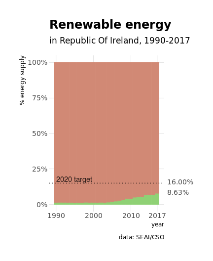

<!-- README.md is generated from README.Rmd. Please edit that file -->

# Irish Energy Balance Statistics

<!-- badges: start -->

<!-- badges: end -->

``` r
library("pxR")
library("tidyverse")
library("janitor")
library("lubridate")
library("hrbrthemes")
```

## Data

Source: [Sustainable Energy Authority of
Ireland](https://www.cso.ie/px/pxeirestat/Database/eirestat/Energy%20Balance%20Statistics/Energy%20Balance%20Statistics_statbank.asp?SP=Energy%20Balance%20Statistics&Planguage=0&ProductID=DB_SEI)

``` r
energy_balance_px <- read.px("data/SEI01.px")
energy_balance_tbl_raw <- as.data.frame(energy_balance_px) %>%
  as_tibble() %>%
  clean_names()
# attr(energy_balance_tbl_raw$value, "label") <- "ktoe" # kilotonne of oil equivalent
head(energy_balance_tbl_raw)
#> # A tibble: 6 x 4
#>   year  fuel_type                energy_supply_and_consumption value
#>   <fct> <fct>                    <fct>                         <dbl>
#> 1 1990  Sum of all fuel products Indigenous production          3471
#> 2 1991  Sum of all fuel products Indigenous production          3291
#> 3 1992  Sum of all fuel products Indigenous production          3086
#> 4 1993  Sum of all fuel products Indigenous production          3456
#> 5 1994  Sum of all fuel products Indigenous production          3565
#> 6 1995  Sum of all fuel products Indigenous production          4105
```

## Munging

``` r
energy_balance_tbl <- energy_balance_tbl_raw %>%
  mutate_at(vars(year), parse_date_time, orders = "%Y") %>%
  filter(!str_detect(fuel_type, "^Sum of all")) %>%
  rename(energy = value) %>%
  filter(!fuel_type %in% c("Heat", "Non renewable waste")) %>% # remove fuels I don't understand
  mutate(
    fuel_type = str_replace(fuel_type, "Electricity", "imported electricity"),
    fuel_type_category = fct_collapse(fuel_type,
      renewable = c("Hydro", "Wind", "Landfill gas", "Biogas", "Biomass", "Liquid Biofuel", "Solar", "Geothermal"),
      petroleum = c("Crude oil", "Refinery gas", "Gasoline", "Kerosene", "Jet kerosene", "Fuel oil", "LPG", "Gasoil/diesel/DERV", "Petroleum coke", "Naphta", "Bitumen", "White spirit", "Lubricants", "Natural gas"),
      coal = c("Coke", "Lignite", "Bituminous coal", "Anthracite and manufactured ovoids"),
      peat = c("Milled peat", "Sod peat", "Briquettes")
    )
  ) %>%
  filter(!str_detect(energy_supply_and_consumption, "[Ss]um of all")) %>%# remove summary rows
  filter(!energy_supply_and_consumption %in% c("Total final energy consumption", "Final non energy consumption feedstocks", "Available final energy consumption", "Statistical difference", "Primary energy supply including non energy", "Primary energy requirement excluding non energy")) %>%
  mutate(
    energy_supply_and_consumption_subsubcategory = fct_collapse(energy_supply_and_consumption, # heavy usage of datapasta
      `indigenous production` = "Indigenous production",
      imports = "Imports",
      exports = "Exports",
      `stock change` = "Stock change",
      bunkers = "Mar. bunkers",
      `energy distribution` = c("Own use and distribution losses"),
      residential = c("Residential"),
      agricultural = c("Agricultural"),
      fisheries = c("Fisheries"),
      `commercial and public services` = c("Commercial services", "Public services"),
      aviation = c("Transport- fuel tourism", "Transport- international aviation", "Transport- domestic aviation"),
      road = c("Transport- road freight", "Transport- road private car", "Transport- road public passenger services", "Transport- road light goods vehicle"),
      rail = c("Transport- rail"),
      navigation = c("Transport - navigation"),
      `other transport` = "Transport- unspecified",
      industry = c("Industry- non energy mining", "Industry- food, beverages and tobacco", "Industry- textiles and textile products", "Industry- wood and wood products", "Industry- pulp, paper, publishing and printing", "Industry- chemicals and man-made fibres", "Industry- rubber and plastic products", "Industry- other non-metallic mineral products", "Industry- basic metals and fabricated metal products", "Industry- machinery and equipment n.e.c", "Industry- electrical and optical equipment", "Industry- transport equipment manufacture", "Industry- other manufacturing"),
      `transformation input` = c("Transformation input- public thermal power plants", "Transformation input- combined heat and power plants", "Transformation input- pumped storage consumption", "Transformation input- briquetting plants", "Transformation input- oil refineries and other energy sectors"),
      `transformation output` = c("Transformation output- public thermal power plants", "Transformation output- combined heat and power plants- electricity", "Transformation output- combined heat and power plants- heat", "Transformation output- pumped storage consumption", "Transformation output- briquetting plants", "Transformation output- oil refineries"),
      `echanges and transfer` = c("Exchanges and transfers- electricity", "Exchanges and transfers- heat", "Exchanges and transfers- other (excluding electricity and heat)"),
      `non-energy consumption` = "Non-energy consumption"
    ),
    energy_supply_and_consumption_subcategory = fct_collapse(energy_supply_and_consumption_subsubcategory,
      transport = c("navigation", "rail", "road", "aviation", "other transport"),
      rci = c("residential", "commercial and public services", "industry", "agricultural", "fisheries"),
    ),
    energy_supply_and_consumption_category = fct_collapse(energy_supply_and_consumption_subcategory,
      consumption = c("transport", "rci"),
      `supply gains` = c("indigenous production", "imports"),
      `supply loses` = c("exports", "bunkers")
    )
  ) %>%
  mutate_at(vars(energy_supply_and_consumption), str_remove, pattern = "^.*-")
```

## Analysis

### Production

``` r
energy_balance_tbl %>% 
  filter(energy_supply_and_consumption_category  == "supply gains") %>% 
  group_by(year, fuel_type_category) %>% 
  summarise(total_production = sum(energy)) %>% 
  ungroup() %>% 
  ggplot(mapping = aes(x = year(year), y = total_production, group = fuel_type_category)) +
    geom_line() +
    theme_minimal() +
  facet_wrap(~fuel_type_category, scales = "free_y") +
  NULL
```

<!-- -->

#### Dependencies

``` r
energy_balance_tbl %>% 
  filter(energy_supply_and_consumption_category  == "supply gains") %>% 
  group_by(year, fuel_type_category, energy_supply_and_consumption) %>% 
  summarise(energy = sum(energy)) %>% 
  ggplot(mapping = aes(x = year, y = energy)) +
  geom_bar(mapping = aes(fill = energy_supply_and_consumption), stat = "identity") +
  facet_wrap(~fuel_type_category) +
  theme(
    legend.position = c(1, 0),
    legend.justification = c(1, 0)
  ) +
  labs(
    fill = "source"
  )
```

<!-- -->

### Renewable

``` r
p <- energy_balance_tbl %>% 
  filter(energy_supply_and_consumption_category  == "supply gains") %>% 
  filter(!fuel_type == "Electricity") %>% 
  mutate(is_renewable = fuel_type_category == "renewable") %>% 
  group_by(year, is_renewable) %>% 
  summarise(energy = sum(energy)) %>% 
  ggplot(mapping = aes(x = year(year), y = energy, fill = is_renewable, colour = is_renewable)) +
  geom_bar(stat = "identity", position = "fill") +
  geom_hline(yintercept = 0.16 - 0.01, size = 0.5, linetype = "dotted") +
  annotate("text", x = 1990, y = 0.16, label = "2020 target", colour = "black", hjust = 0, vjust = 0, alpha = 0.8) +
  scale_y_continuous(labels = scales::percent, sec.axis = dup_axis(breaks = c(0.0863078, 0.16), labels = scales::percent)) +
  scale_x_continuous(breaks = c(1990, 2000, 2010, 2017)) +
  scale_color_ipsum() +
  scale_fill_ipsum() +
  theme_ipsum() +
  theme(
    legend.position = "none",
    axis.text = element_text(),
    axis.title.y.right = element_blank(),
    panel.grid.minor = element_blank()
  ) +
  labs(
    title = "The rise of renewable energy",
    subtitle = "in Republic Of Ireland, 1990-2017",
    x = "year",
    y = "% energy supply",
    caption = "data: SEAI/CSO"
  )

p
```

<!-- -->

### Comsuption

``` r
p <- energy_balance_tbl %>% 
  filter(energy_supply_and_consumption_category  == "consumption") %>% 
  group_by(year, energy_supply_and_consumption_subsubcategory, energy_supply_and_consumption_subcategory) %>% 
  summarise(energy = sum(energy)) %>% 
  ggplot(mapping = aes(x = year(year), y = energy)) +
  geom_line(mapping = aes(group = energy_supply_and_consumption_subsubcategory)) +
  scale_x_continuous(breaks = c(1990, 2000, 2010, 2017)) +
  theme_minimal() +
  theme(
    legend.position = c(0, 1),
    legend.justification = c(0, 1)
  ) +
  facet_wrap(~ energy_supply_and_consumption_subsubcategory, scales = "free_y", ncol = 3) +
  NULL
  
p
```

<!-- -->

### consumption

``` r

# consumption_data <- energy_balance_tbl %>% 
#   filter(year(year) == 2009) %>%
#   filter(energy_supply_and_consumption_category == "consumption") %>% 
# 
# 
```

## Session info
