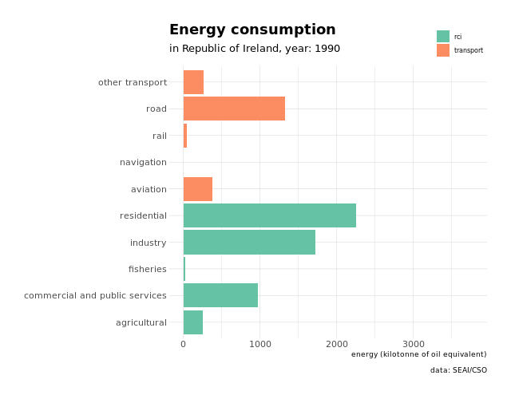

<!-- README.md is generated from README.Rmd. Please edit that file -->

# Irish Energy Balance Statistics

<!-- badges: start -->

<!-- badges: end -->

``` r
library("pxR")
library("tidyverse")
library("janitor")
library("lubridate")
library("hrbrthemes")
library("ggstance")
library("gganimate")
```

*Disclaimer: I am not an expert in energy. I quickly realised the
following visualisations for my first TidyTuesday, and to learn how to
use {[gganimate](https://github.com/thomasp85/gganimate)}. I’m sure I
made some mistakes along the way and that things could look a little bit
better.*

## Data

Source: [Sustainable Energy Authority of
Ireland](https://www.cso.ie/px/pxeirestat/Database/eirestat/Energy%20Balance%20Statistics/Energy%20Balance%20Statistics_statbank.asp?SP=Energy%20Balance%20Statistics&Planguage=0&ProductID=DB_SEI).

``` r
energy_balance_px <- read.px("data/SEI01.px")
energy_balance_tbl_raw <- as.data.frame(energy_balance_px) %>%
  as_tibble() %>%
  clean_names()

sample_n(energy_balance_tbl_raw, 10)
#> # A tibble: 10 x 4
#>    year  fuel_type                     energy_supply_and_consumption                           value
#>    <fct> <fct>                         <fct>                                                   <dbl>
#>  1 2001  Kerosene                      Total final energy consumption                            746
#>  2 1993  Naphta                        Primary energy requirement excluding non energy           -30
#>  3 2016  Hydro                         Industry- pulp, paper, publishing and printing              0
#>  4 1999  Anthracite and manufactured … Fisheries                                                   0
#>  5 2012  Bituminous coal               Transformation input- briquetting plants                    0
#>  6 2004  Biomass                       Exports                                                     0
#>  7 1994  Petroleum coke                Transport- Sum of all aviation transport                    0
#>  8 1998  Biogas                        Transport- road private car                                 0
#>  9 2006  White spirit                  Transformation output- combined heat and power plants-…     0
#> 10 2007  White spirit                  Transport- road light goods vehicle                         0
```

## Munging

``` r
energy_balance_tbl <- energy_balance_tbl_raw %>%
  mutate_if(is.factor, as.character) %>% 
  mutate_at(vars(year), parse_date_time, orders = "%Y") %>%
  filter(!str_detect(fuel_type, "^Sum of all")) %>%
  rename(energy = value) %>%
  filter(!fuel_type %in% c("Heat", "Non renewable waste")) %>% # remove fuels I don't understand
  mutate(
    fuel_type = str_replace(fuel_type, "Electricity", "imported electricity"),
    fuel_type_category = fct_collapse(fuel_type,
      renewable = c("Hydro", "Wind", "Landfill gas", "Biogas", "Biomass", "Liquid Biofuel", "Solar", "Geothermal"),
      petroleum = c("Crude oil", "Refinery gas", "Gasoline", "Kerosene", "Jet kerosene", "Fuel oil", "LPG", "Gasoil/diesel/DERV", "Petroleum coke", "Naphta", "Bitumen", "White spirit", "Lubricants", "Natural gas"),
      coal = c("Coke", "Lignite", "Bituminous coal", "Anthracite and manufactured ovoids"),
      peat = c("Milled peat", "Sod peat", "Briquettes")
    )
  ) %>%
  filter(!str_detect(energy_supply_and_consumption, "[Ss]um of all")) %>% # remove summary rows
  filter(!energy_supply_and_consumption %in% c("Total final energy consumption", "Final non energy consumption feedstocks", "Available final energy consumption", "Statistical difference", "Primary energy supply including non energy", "Primary energy requirement excluding non energy")) %>%
  mutate(
    energy_supply_and_consumption_subsubcategory = fct_collapse(energy_supply_and_consumption, # heavy usage of datapasta
      `indigenous production` = "Indigenous production",
      imports = "Imports",
      exports = "Exports",
      `stock change` = "Stock change",
      bunkers = "Mar. bunkers",
      `energy distribution` = c("Own use and distribution losses"),
      residential = c("Residential"),
      agricultural = c("Agricultural"),
      fisheries = c("Fisheries"),
      `commercial and public services` = c("Commercial services", "Public services"),
      aviation = c("Transport- fuel tourism", "Transport- international aviation", "Transport- domestic aviation"),
      road = c("Transport- road freight", "Transport- road private car", "Transport- road public passenger services", "Transport- road light goods vehicle"),
      rail = c("Transport- rail"),
      navigation = c("Transport - navigation"),
      `other transport` = "Transport- unspecified",
      industry = c("Industry- non energy mining", "Industry- food, beverages and tobacco", "Industry- textiles and textile products", "Industry- wood and wood products", "Industry- pulp, paper, publishing and printing", "Industry- chemicals and man-made fibres", "Industry- rubber and plastic products", "Industry- other non-metallic mineral products", "Industry- basic metals and fabricated metal products", "Industry- machinery and equipment n.e.c", "Industry- electrical and optical equipment", "Industry- transport equipment manufacture", "Industry- other manufacturing"),
      `transformation input` = c("Transformation input- public thermal power plants", "Transformation input- combined heat and power plants", "Transformation input- pumped storage consumption", "Transformation input- briquetting plants", "Transformation input- oil refineries and other energy sectors"),
      `transformation output` = c("Transformation output- public thermal power plants", "Transformation output- combined heat and power plants- electricity", "Transformation output- combined heat and power plants- heat", "Transformation output- pumped storage consumption", "Transformation output- briquetting plants", "Transformation output- oil refineries"),
      `echanges and transfer` = c("Exchanges and transfers- electricity", "Exchanges and transfers- heat", "Exchanges and transfers- other (excluding electricity and heat)"),
      `non-energy consumption` = "Non-energy consumption"
    ),
    energy_supply_and_consumption_subcategory = fct_collapse(energy_supply_and_consumption_subsubcategory,
      transport = c("navigation", "rail", "road", "aviation", "other transport"),
      rci = c("residential", "commercial and public services", "industry", "agricultural", "fisheries"),
    ),
    energy_supply_and_consumption_category = fct_collapse(energy_supply_and_consumption_subcategory,
      consumption = c("transport", "rci"),
      `supply gains` = c("indigenous production", "imports"),
      `supply loses` = c("exports", "bunkers")
    )
  ) %>%
  mutate_at(vars(energy_supply_and_consumption), str_remove, pattern = "^.*-")
```

## Visualisations

### Renewable energy

``` r
renewable_plot <- energy_balance_tbl %>%
  filter(energy_supply_and_consumption_category == "supply gains") %>%
  filter(!fuel_type == "Electricity") %>%
  mutate(is_renewable = fuel_type_category == "renewable") %>%
  group_by(year, is_renewable) %>%
  summarise(energy = sum(energy)) %>%
  ggplot(mapping = aes(x = year(year), y = energy, fill = is_renewable, colour = is_renewable)) +
  geom_bar(stat = "identity", position = "fill") +
  geom_hline(yintercept = 0.16 - 0.01, size = 0.5, linetype = "dotted") +
  annotate("text", x = 1990, y = 0.16, label = "2020 target", colour = "black", hjust = 0, vjust = 0, alpha = 0.8) +
  scale_y_continuous(labels = scales::percent, sec.axis = dup_axis(breaks = c(0.0863078, 0.16), labels = scales::percent)) +
  scale_x_continuous(breaks = c(1990, 2000, 2010, 2017)) +
  scale_color_ipsum() +
  scale_fill_ipsum() +
  theme_ipsum_pub() +
  theme(
    legend.position = "none",
    axis.text = element_text(),
    axis.title.y.right = element_blank(),
    panel.grid.minor = element_blank()
  ) +
  labs(
    title = "Renewable energy",
    subtitle = "in Republic Of Ireland, 1990-2017",
    x = "year",
    y = "% energy supply",
    caption = "data: SEAI/CSO"
  )

renewable_plot
```

<!-- -->

``` r

ggsave("renewable_energy_roi.png")
#> Saving 4.5 x 5.5 in image
```

Ireland is only green from the sky. More renewable source of energies
would also make the island less dependent from other countries petrol.

### Energy production

``` r
production_anim <- energy_balance_tbl %>%
  filter(energy_supply_and_consumption_category == "supply gains") %>%
  mutate(fuel_type = fct_reorder(fuel_type, as.numeric(fuel_type_category))) %>%
  ggplot(mapping = aes(x = energy, y = fuel_type, fill = fuel_type_category)) +
  geom_barh(stat = "identity") +
  theme_ipsum_pub() +
  scale_fill_ipsum(guide = guide_legend(nrow = 2)) +
  theme(
    legend.position = c(1, 1),
    legend.justification = c(1, 1),
    legend.direction = "horizontal",
    axis.title.y = element_blank()
  ) +
  labs(
    title = "Energy production",
    subtitle = "in Republic of Ireland, year: {year(frame_time)}",
    x = "energy (kilotonne of oil equivalent)",
    fill = "",
    caption = "data: SEAI/CSO"
  ) +
  transition_time(year) +
  enter_grow()

animate(production_anim, width = 600, height = 600, units = "px")
```

<!-- -->

``` r

anim_save("production_energy_roi.gif")
```

### Energy consumption

``` r
consumption_anim <- energy_balance_tbl %>%
  filter(energy_supply_and_consumption_category == "consumption") %>% 
  group_by(year, energy_supply_and_consumption_subsubcategory, energy_supply_and_consumption_subcategory) %>% 
  summarise(energy = sum(energy)) %>% 
  ggplot(mapping = aes(x = energy, y = energy_supply_and_consumption_subsubcategory, fill = energy_supply_and_consumption_subcategory)) +
  geom_barh(stat = "identity") +
  theme_ipsum_pub() +
  scale_fill_brewer(palette = "Set2", guide = guide_legend(nrow = 2)) +
  theme(
    legend.position = c(1, 1.15),
    legend.justification = c(1, 1),
    legend.direction = "horizontal",
    axis.title.y = element_blank()
  ) +
  labs(
    title = "Energy consumption",
    subtitle = "in Republic of Ireland, year: {year(frame_time)}",
    x = "energy (kilotonne of oil equivalent)",
    fill = "",
    caption = "data: SEAI/CSO"
  ) +
  transition_time(year) +
  enter_grow()
  

animate(consumption_anim, width = 640, height = 500, units = "px")
```

<!-- -->

``` r

anim_save("consumption_energy_roi.gif")
```

## Session info

``` r
sessioninfo::session_info()
#> ─ Session info ───────────────────────────────────────────────────────────────────────────────────
#>  setting  value                       
#>  version  R version 3.4.4 (2018-03-15)
#>  os       Linux Mint 18.3             
#>  system   x86_64, linux-gnu           
#>  ui       X11                         
#>  language en_IE:en                    
#>  collate  en_IE.UTF-8                 
#>  ctype    en_IE.UTF-8                 
#>  tz       Europe/Dublin               
#>  date     2019-05-20                  
#> 
#> ─ Packages ───────────────────────────────────────────────────────────────────────────────────────
#>  package      * version    date       lib source                              
#>  assertthat     0.2.1      2019-03-21 [1] CRAN (R 3.4.4)                      
#>  backports      1.1.4      2019-04-10 [1] CRAN (R 3.4.4)                      
#>  broom          0.5.2      2019-04-07 [1] CRAN (R 3.4.4)                      
#>  cellranger     1.1.0      2016-07-27 [1] CRAN (R 3.4.3)                      
#>  cli            1.1.0      2019-03-19 [1] CRAN (R 3.4.4)                      
#>  colorspace     1.4-1      2019-03-18 [1] CRAN (R 3.4.4)                      
#>  crayon         1.3.4      2017-09-16 [1] CRAN (R 3.4.4)                      
#>  digest         0.6.18     2018-10-10 [1] CRAN (R 3.4.4)                      
#>  dplyr        * 0.8.1      2019-05-14 [1] CRAN (R 3.4.4)                      
#>  ellipsis       0.1.0      2019-02-19 [1] CRAN (R 3.4.4)                      
#>  evaluate       0.13       2019-02-12 [1] CRAN (R 3.4.4)                      
#>  extrafont      0.17       2014-12-08 [1] CRAN (R 3.4.4)                      
#>  extrafontdb    1.0        2012-06-11 [1] CRAN (R 3.4.2)                      
#>  fansi          0.4.0      2018-10-05 [1] CRAN (R 3.4.4)                      
#>  farver         1.1.0      2018-11-20 [1] CRAN (R 3.4.4)                      
#>  forcats      * 0.4.0      2019-02-17 [1] CRAN (R 3.4.4)                      
#>  gdtools        0.1.8      2019-04-02 [1] CRAN (R 3.4.4)                      
#>  generics       0.0.2      2018-11-29 [1] CRAN (R 3.4.4)                      
#>  gganimate    * 1.0.3      2019-04-02 [1] CRAN (R 3.4.4)                      
#>  ggplot2      * 3.1.1      2019-04-07 [1] CRAN (R 3.4.4)                      
#>  ggstance     * 0.3.1      2018-07-20 [1] CRAN (R 3.4.4)                      
#>  gifski         0.8.6      2018-09-28 [1] CRAN (R 3.4.4)                      
#>  glue           1.3.1      2019-03-12 [1] CRAN (R 3.4.4)                      
#>  gtable         0.3.0      2019-03-25 [1] CRAN (R 3.4.4)                      
#>  haven          2.1.0      2019-02-19 [1] CRAN (R 3.4.4)                      
#>  hms            0.4.2      2018-03-10 [1] CRAN (R 3.4.3)                      
#>  hrbrthemes   * 0.7.0      2019-05-18 [1] Github (hrbrmstr/hrbrthemes@934e5e1)
#>  htmltools      0.3.6      2017-04-28 [1] CRAN (R 3.4.2)                      
#>  httr           1.4.0      2018-12-11 [1] CRAN (R 3.4.4)                      
#>  janitor      * 1.2.0      2019-04-21 [1] CRAN (R 3.4.4)                      
#>  jsonlite       1.6        2018-12-07 [1] CRAN (R 3.4.4)                      
#>  knitr          1.23       2019-05-18 [1] CRAN (R 3.4.4)                      
#>  labeling       0.3        2014-08-23 [1] CRAN (R 3.4.2)                      
#>  lattice        0.20-38    2018-11-04 [1] CRAN (R 3.4.4)                      
#>  lazyeval       0.2.2      2019-03-15 [1] CRAN (R 3.4.4)                      
#>  lubridate    * 1.7.4      2018-04-11 [1] CRAN (R 3.4.4)                      
#>  magrittr       1.5        2014-11-22 [1] CRAN (R 3.4.3)                      
#>  modelr         0.1.4      2019-02-18 [1] CRAN (R 3.4.4)                      
#>  munsell        0.5.0      2018-06-12 [1] CRAN (R 3.4.4)                      
#>  nlme           3.1-137    2018-04-07 [4] CRAN (R 3.4.4)                      
#>  pillar         1.4.0      2019-05-11 [1] CRAN (R 3.4.4)                      
#>  pkgconfig      2.0.2      2018-08-16 [1] CRAN (R 3.4.4)                      
#>  plyr         * 1.8.4      2016-06-08 [1] CRAN (R 3.4.2)                      
#>  png            0.1-7      2013-12-03 [1] CRAN (R 3.4.4)                      
#>  prettyunits    1.0.2      2015-07-13 [1] CRAN (R 3.4.2)                      
#>  progress       1.2.2      2019-05-16 [1] CRAN (R 3.4.4)                      
#>  purrr        * 0.3.2      2019-03-15 [1] CRAN (R 3.4.4)                      
#>  pxR          * 0.42.2     2017-01-12 [1] CRAN (R 3.4.4)                      
#>  R6             2.4.0      2019-02-14 [1] CRAN (R 3.4.4)                      
#>  RColorBrewer   1.1-2      2014-12-07 [1] CRAN (R 3.4.3)                      
#>  Rcpp           1.0.1      2019-03-17 [1] CRAN (R 3.4.4)                      
#>  readr        * 1.3.1      2018-12-21 [1] CRAN (R 3.4.4)                      
#>  readxl         1.3.1      2019-03-13 [1] CRAN (R 3.4.4)                      
#>  reshape2     * 1.4.3      2017-12-11 [1] CRAN (R 3.4.3)                      
#>  RJSONIO      * 1.3-1.1    2018-11-14 [1] CRAN (R 3.4.4)                      
#>  rlang          0.3.4      2019-04-07 [1] CRAN (R 3.4.4)                      
#>  rmarkdown      1.12       2019-03-14 [1] CRAN (R 3.4.4)                      
#>  rstudioapi     0.10       2019-03-19 [1] CRAN (R 3.4.4)                      
#>  Rttf2pt1       1.3.7      2018-06-29 [1] CRAN (R 3.4.4)                      
#>  rvest          0.3.4      2019-05-15 [1] CRAN (R 3.4.4)                      
#>  scales         1.0.0      2018-08-09 [1] CRAN (R 3.4.4)                      
#>  sessioninfo    1.1.1      2018-11-05 [1] CRAN (R 3.4.4)                      
#>  snakecase      0.10.0     2019-05-16 [1] CRAN (R 3.4.4)                      
#>  stringi        1.4.3      2019-03-12 [1] CRAN (R 3.4.4)                      
#>  stringr      * 1.4.0      2019-02-10 [1] CRAN (R 3.4.4)                      
#>  tibble       * 2.1.1      2019-03-16 [1] CRAN (R 3.4.4)                      
#>  tidyr        * 0.8.3      2019-03-01 [1] CRAN (R 3.4.4)                      
#>  tidyselect     0.2.5      2018-10-11 [1] CRAN (R 3.4.4)                      
#>  tidyverse    * 1.2.1      2017-11-14 [1] CRAN (R 3.4.4)                      
#>  tweenr         1.0.1      2018-12-14 [1] CRAN (R 3.4.4)                      
#>  utf8           1.1.4      2018-05-24 [1] CRAN (R 3.4.4)                      
#>  vctrs          0.1.0      2018-11-29 [1] CRAN (R 3.4.4)                      
#>  withr          2.1.2.9000 2019-05-19 [1] Github (jimhester/withr@79c5e36)    
#>  xfun           0.7        2019-05-14 [1] CRAN (R 3.4.4)                      
#>  xml2           1.2.0      2018-01-24 [1] CRAN (R 3.4.3)                      
#>  yaml           2.2.0      2018-07-25 [1] CRAN (R 3.4.4)                      
#>  zeallot        0.1.0      2018-01-28 [1] CRAN (R 3.4.4)                      
#> 
#> [1] /home/jean/R/x86_64-pc-linux-gnu-library/3.4
#> [2] /usr/local/lib/R/site-library
#> [3] /usr/lib/R/site-library
#> [4] /usr/lib/R/library
```
